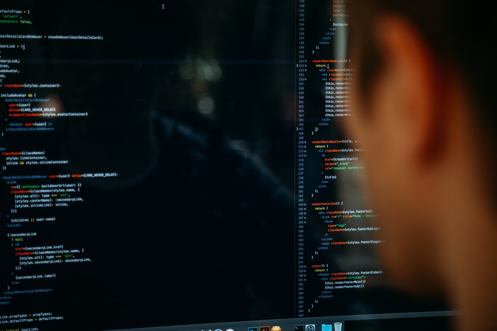
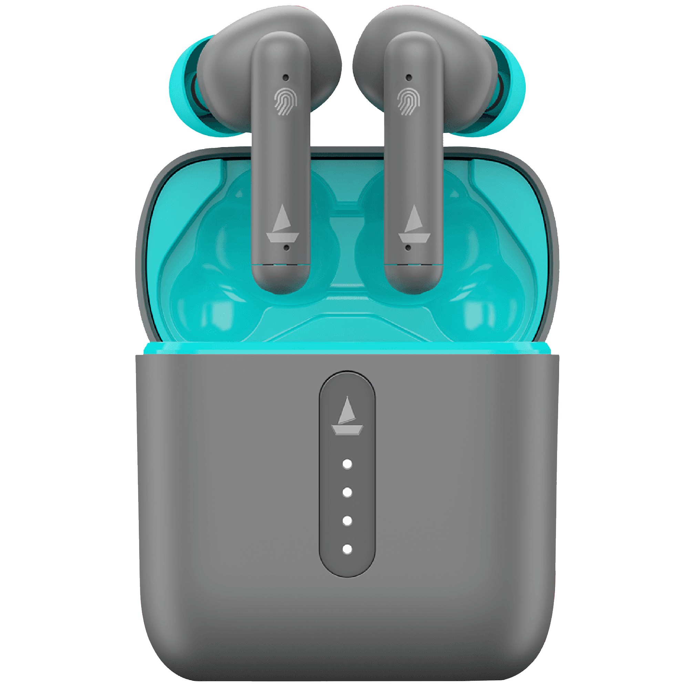

<!doctype html>
<html lang="en">

<head>
    <meta charset="utf-8">
    <meta name="viewport" content="width=device-width, initial-scale=1">
    <title>IEEE MLAS 2.0</title>
    <link href="https://cdn.jsdelivr.net/npm/bootstrap@5.2.0/dist/css/bootstrap.min.css" rel="stylesheet"
        integrity="sha384-gH2yIJqKdNHPEq0n4Mqa/HGKIhSkIHeL5AyhkYV8i59U5AR6csBvApHHNl/vI1Bx" crossorigin="anonymous">
    <link rel="stylesheet" href="css/styles.css">
    <link rel="preconnect" href="https://fonts.googleapis.com">
    <link rel="preconnect" href="https://fonts.gstatic.com" crossorigin>
    <link href="https://fonts.googleapis.com/css2?family=Figtree&display=swap" rel="stylesheet">
</head>

<body>
    <!-- Navbar -->
    <nav class="navbar navbar-expand-lg navbar-dark bg-dark">
        

            
            <button class="navbar-toggler" type="button" data-bs-toggle="collapse"
                data-bs-target="#navbarSupportedContent" aria-controls="navbarSupportedContent" aria-expanded="false"
                aria-label="Toggle navigation">
                
            </button>
            

                <ul class="navbar-nav me-auto mb-2 mb-lg-0">
                    <li class="nav-item">
                        <a class="nav-link active" aria-current="page" href="#">Home</a>
                    </li>
                    <li class="nav-item">
                        <a class="nav-link" href="https://www.ieee.org/">About</a>
                    </li>
                    <li class="nav-item">
                        <a class="nav-link" href="https://mlas-reg.netlify.app/">Register</a>
                    </li>
                    <li class="nav-item">
                        <a class="nav-link" href="#blog-contact">Contact Us</a>
                    </li>
                    <li class="nav-item dropdown">
                        <a class="nav-link dropdown-toggle" href="#" role="button" data-bs-toggle="dropdown"
                            aria-expanded="false">
                            More
                        </a>
                        <ul class="dropdown-menu">
                            <li><a class="dropdown-item" href="https://ieee-jaduniv.in/blog/">Blog</a></li>
                            <li><a class="dropdown-item" href="https://ieee-jaduniv.in/event.html">Events</a></li>
                            <li><a class="dropdown-item" href="https://ieee-jaduniv.in/team.html">Team</a></li>
                            <li>
                                

                            </li>
                            <li><a class="dropdown-item" href="#">Branch Chapters</a></li>
                        </ul>
                    </li>
                </ul>
                <!-- <form class="d-flex" role="search">
                    <input class="form-control me-2" type="search" placeholder="Search" aria-label="Search">
                    <button class="btn btn-outline-success" type="submit">Search</button>
                </form> -->
            

        

    </nav>
    <!-- bootstrap carousel -->
    

        

            

                <button type="button" data-bs-target="#carouselExampleCaptions" data-bs-slide-to="0" class="active"
                    aria-current="true" aria-label="Slide 1"></button>
                <button type="button" data-bs-target="#carouselExampleCaptions" data-bs-slide-to="1"
                    aria-label="Slide 2"></button>
                <button type="button" data-bs-target="#carouselExampleCaptions" data-bs-slide-to="2"
                    aria-label="Slide 3"></button>
            

            

                

                    
                    

                        <h2>ML Accelerator Summit 2.0</h2>
                        
End to end solutions of problems with ML and DL

                    

                

                

                    
                    

                        <h2>31st July 2022</h2>
                        
"IEEE is back! First results from first offline event in JU"-BERT

                    

                

                

                    
                    

                        <h2>Hands-On Experience</h2>
                        
An introduction to Machine Learning and AI, with hands-on-coding, guided by mentors.

                    

                

            

            <button class="carousel-control-prev" type="button" data-bs-target="#carouselExampleCaptions"
                data-bs-slide="prev">
                
                Previous
            </button>
            <button class="carousel-control-next" type="button" data-bs-target="#carouselExampleCaptions"
                data-bs-slide="next">
                
                Next
            </button>
        

    

       
    <h2 id="top-heading" class="text-light">Machine Learning Accelerator Summit 2.0, presented by IEEE JU SB</h2>
       
    <!-- Bootstrap cards to display more content -->
    <!-- 

        

            

                

                    
                    

                        <h5 class="card-title text-primary">Our Chief Guest</h5>
                        
We are extremely honored to have Mr. Krishnachur Das as our
                            chief guest.

                        <a href="https://www.linkedin.com/in/krisg04/" class="btn btn-primary">LinkedIn Profile</a>
                    

                

            

            

                

                    
                    

                        <h5 class="card-title text-success">About the Event</h5>
                        
This event is IEEE JU SB's flagship event to sow the seeds of
                            interest and information about ML in young minds. We seek to deliver real problem-solving
                            experience starting from the core fundamentals of ML.

                    

                

            

        

    
 -->
    <!-- experiment -->
    

        

            

                

                    

                        <strong class="d-inline-block mb-2 text-primary">Our Chief Guest</strong>
                        <h3 class="mb-0 text-light">Mr. Krishnachur Das</h3>

                        
We are extremely honored to have Mr. Krishnachur Das as
                            our chief guest.

                        <a href="https://www.linkedin.com/in/krisg04/" class="btn btn-primary">LinkedIn Profile</a>
                    

                    

                        

                    

                

            

            

                

                    

                        <strong class="d-inline-block mb-2 text-success">About the Event</strong>
                        
This event is IEEE JU SB's flagship event to sow the seeds of
                            interest and information about ML in young minds. We seek to deliver real problem-solving
                            experience starting from the core fundamentals of ML

                    

                    

                        

                    

                

            

        

    

       
    <!-- card for prizes -->
    <h1 class="text-light">Prizes and Rewards</h1>
      
    

        

            

                

                    

                        <!-- <strong class="d-inline-block mb-2 text-primary">Our Chief Guest</strong>
                    <h3 class="mb-0 text-light">Mr. Krishnachur Das</h3> -->

                        

                        <h3 class="prize text-light">Amazon Echo Dot</h3>
                        

                    

                    

                        

                    

                

            

            

                

                    

                        

                        <h3 class="prize text-light">Boat Airdopes</h3>
                        

                    

                    

                        

                    

                

            

        

    

      
    <!-- accordion for faqs -->
    <h1 class="text-light">Frequently Asked Questions(FAQs)</h1>
      
    

        

            

              <h2 class="accordion-header" id="headingOne">
                <button class="accordion-button bg-dark text-light" type="button" data-bs-toggle="collapse" data-bs-target="#collapseOne" aria-expanded="true" aria-controls="collapseOne">
                    Can UG-3 and UG-4 students attend this?
                </button>
              </h2>
              

                

                    
It is an introductory session to introduce first years to the world of ML. But if you are willing to join us in this journey, you are most welcome.

                

              

            

            

              <h2 class="accordion-header" id="headingTwo">
                <button class="accordion-button collapsed bg-dark text-light" type="button" data-bs-toggle="collapse" data-bs-target="#collapseTwo" aria-expanded="false" aria-controls="collapseTwo">
                    How can we register?
                </button>
              </h2>
              

                

                 
Click the "Register" button at the top of the website and fill the necessary details in the form

                

              

            

            

              <h2 class="accordion-header" id="headingThree">
                <button class="accordion-button collapsed bg-dark text-light" type="button" data-bs-toggle="collapse" data-bs-target="#collapseThree" aria-expanded="false" aria-controls="collapseThree">
                    What topics will be covered in the session?
                </button>
              </h2>
              

                

                  
It will be revealed soon. Let there be some element of surprise so the anticipation doesn't die.

                

              

            

            

                <h2 class="accordion-header" id="headingFour">
                  <button class="accordion-button collapsed bg-dark text-light" type="button" data-bs-toggle="collapse" data-bs-target="#collapseFour" aria-expanded="false" aria-controls="collapseFour">
                    What prerequisite knowledge do I need for this event?
                  </button>
                </h2>
                

                  

                    
No prerequisites are required as such. But a prior knowledge of python would be helpful.

                  

                

              

              

                <h2 class="accordion-header" id="headingFive">
                  <button class="accordion-button collapsed bg-dark text-light" type="button" data-bs-toggle="collapse" data-bs-target="#collapseFive" aria-expanded="false" aria-controls="collapseFive">
                    Is this only for JU students?
                  </button>
                </h2>
                

                  

                    
Yes, it is only for JU students.

                  

                

              

              

                <h2 class="accordion-header" id="headingSix">
                  <button class="accordion-button collapsed bg-dark text-light" type="button" data-bs-toggle="collapse" data-bs-target="#collapseSix" aria-expanded="false" aria-controls="collapseSix">
                    Can I attend this event virtually?
                  </button>
                </h2>
                

                  

                    Unfortunately, you cannot. It is our first offline event after the pandemic and we expect enthusiastic physical presence.
                  

                

              

              

                <h2 class="accordion-header" id="headingSeven">
                  <button class="accordion-button collapsed bg-dark text-light" type="button" data-bs-toggle="collapse" data-bs-target="#collapseSeven" aria-expanded="false" aria-controls="collapseSeven">
                    Who are the speakers?
                  </button>
                </h2>
                

                  

                    
It shall be revealed shortly.

                  

                

              

          

    

       
    <!-- cards for venue and map -->
    

        <!-- 

            

                

                    

                      <h5 class="card-title text-success">Venue</h5>
                      
TEQIP Building, Jadavpur University, Kolkata
    
                        Address: 188, Raja S.C. Mallick Rd,
                        Kolkata 700032.Ph:+9133-24146666

                    

                  

            

            

                

                    <iframe src="https://www.google.com/maps/embed?pb=!1m18!1m12!1m3!1d3686.1369534718197!2d88.36821881463615!3d22.499044241337266!2m3!1f0!2f0!3f0!3m2!1i1024!2i768!4f13.1!3m3!1m2!1s0x3a02712485fb0c29%3A0x6ebc31fad40fb989!2sTEQIP%20Building!5e0!3m2!1sen!2sin!4v1657038796247!5m2!1sen!2sin" width="300" height="200" style="border: 2px solid rgba(0, 0, 0, 0.171); border-radius: 10px;" allowfullscreen="" loading="lazy"></iframe>
                  

            

        
 -->
        

            

                

                    

                        <strong class="d-inline-block mb-2 text-light">Venue</strong>
                        

                        
TEQIP Building, Jadavpur University, Kolkata
    
                            Address: 188, Raja S.C. Mallick Rd,
                            Kolkata 700032.Ph:+9133-24146666

                        
                    

                    
                

            

            

                

                    

                        <iframe src="https://www.google.com/maps/embed?pb=!1m18!1m12!1m3!1d3686.1369534718197!2d88.36821881463615!3d22.499044241337266!2m3!1f0!2f0!3f0!3m2!1i1024!2i768!4f13.1!3m3!1m2!1s0x3a02712485fb0c29%3A0x6ebc31fad40fb989!2sTEQIP%20Building!5e0!3m2!1sen!2sin!4v1657038796247!5m2!1sen!2sin" width="600" height="200" style="border: 2px solid rgba(0, 0, 0, 0.171); border-radius: 10px;" allowfullscreen="" loading="lazy"></iframe>

                    

                

            

        

        
    

       
    <!-- footer for social media handles -->
    <footer class="blog-footer bg-dark" id="blog-contact">
        
Connect with us

        

          
          
          
        

      </footer>
    
</body>

</html>
